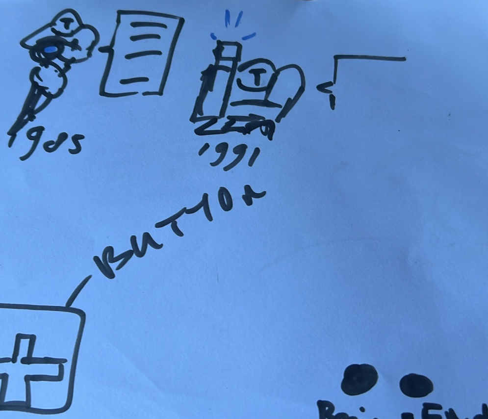
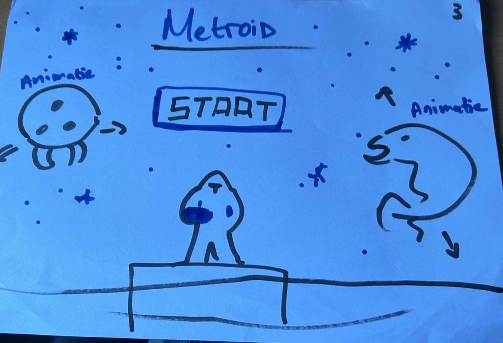
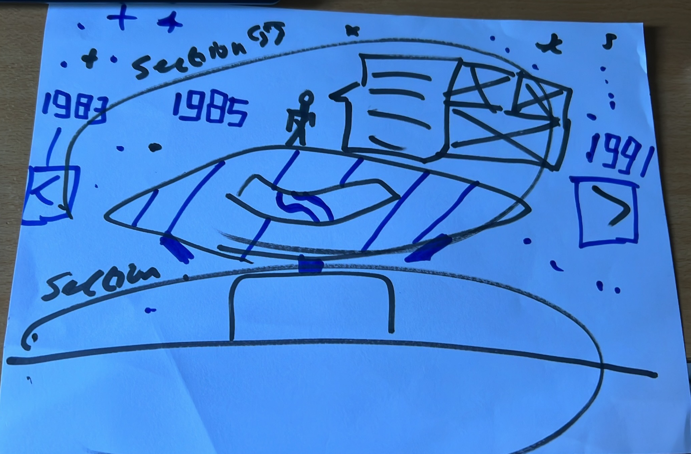
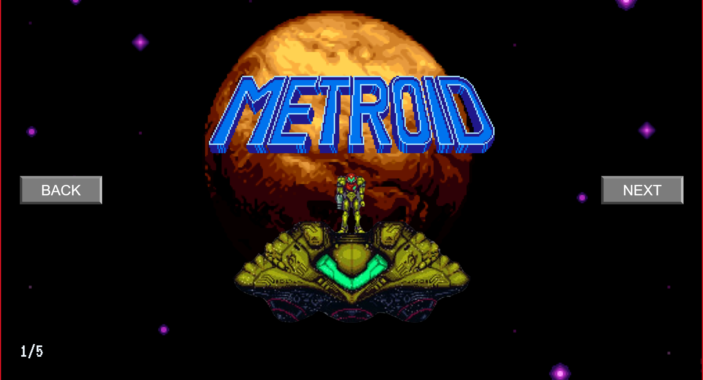

# Procesverslag
Markdown is een simpele manier om HTML te schrijven.  
Markdown cheat cheet: [Hulp bij het schrijven van Markdown](https://github.com/adam-p/markdown-here/wiki/Markdown-Cheatsheet).

Nb. De standaardstructuur en de spartaanse opmaak van de README.md zijn helemaal prima. Het gaat om de inhoud van je procesverslag. Besteedt de tijd voor pracht en praal aan je website.

Nb. Door *open* toe te voegen aan een *details* element kun je deze standaard open zetten. Fijn om dat steeds voor de relevante stuk(ken) te doen.

## Jij

### Ontwerper:
Akshay Kumar

#### Je startniveau:
Mijn startniveau is: blauw

# Je plan

  
De eerste versie/schets van je ontwerp & je persoonlijke uitdaging

  ### De eerste versie/schets:
  

  ### Je ambitie: 
  Aan deze technieken/punten wil ik werken:
  - Pagina navigering
  - Animaties
  - Progressive disclosure
  - Grid en Flexbox
  - Misschien klein beetje Javascript
 

## Voortgang/Feedback 1

  
Mijn bevindingen + wijzigingen (minimaal 5)

  

  ### Bevinding 1:
  De achtergrond wou ik met een overloop hebben in de lucht zodat je de schemering kan zien.
  #### oplossing:
  Ik heb het kunnen oplossen met een linear-gradient toe te passen in mijn CSS.

  
  ### Bevinding 2:
  Het leek me leuk om een compleet website te hebben met een startscherm en dat je als user door kan naar de evolutie van de game.

  #### oplossing:
  Ik kreeg als feedback te horen dat ik me eerst kan focussen op de hoofdcontent en dan ga kijken naar wat er nog kan.

   
  ### Bevinding 3:
  Ik moest me steeds gaan verdiepen in wat mijn game en karakter uniek maakt om dit weer in het uiteindelijke design terug te laten komen.
  #### oplossing:
  Tijdens het analyseren kwam ik erachter dat de robot-suit, de kanon in de arm en de spaceship onderscheidend is van alle andere Nintendo karakters. 
    
  

  ### Bevinding 4:
  Correcte afbeeldingen vinden was soms best wel lastig omdat bij de oude games niet altijd passende images te vinden waren.
  #### oplossing:
  Door goed door te blijven zoeken en de juiste zoektermen te hanteren heb ik mijn weg wel gevonden.

  
  
   ### Bevinding 5:
  Pagina navigering vond ik interessant dus probeerde het zelf te doen maar lukte niet helaas..
  #### oplossing:
  Milan Steman hielp mij met de correcte nummering met een smooth transition erin. Dit is een javascript declaratie en aangeroepen in een functie. 

## Voortgang/Feedback 2

  
Mijn bevindingen + wijzigingen (minimaal 5)

  
  ### Bevinding 1:
  Op elke pagina wil ik dat de logo dezelfde maat heeft ten op zichte van de img.
  #### oplossing:
  Ik heb het kunnen oplossen met width: calc(36.125em * 0.8);, zo de formaat gelijk. 

  ### Bevinding 2:
  Ik vond het lastig om retro te maken, ik vond het idee wel leuk en passend bij de retro versies van de game. 

  #### oplossing:
  Ik heb een voorbeeld gevonden van iemand die retro buttons keurig heeft uitgewerkt en heb ik een beetje aangepast.

  

  

## Voortgang/Feedback 3

  
Mijn bevindingen + wijzigingen (minimaal 5)

  
   ### Bevinding 1:
  Pagina navigering vond ik interessant dus probeerde het zelf te doen maar lukte niet helaas..
  #### oplossing:
  Milan Steman hielp mij met de correcte nummering met een smooth transition erin. Dit is een javascript declaratie en aangeroepen in een functie. 

  
  
  ### Bevinding 2:
  Door het toevoegen van meerdere articles op de pagina's, werkte de navigering even niet meer. 
  #### oplossing:
  Ik kreeg hulp bij het schrijven van efficientere code zodat dit opgelost wordt. Ook werd er voor gezorgd dat hetzelfde probleem niet aanhield wanneer er een article bij komt.

## Reflectie

  
Mijn eindresultaat & persoonlijke ontwikkeling

  ### Je uitkomst - karakteristiek screenshot(s):
  
    

  ### Dit ging goed/Heb ik geleerd: 
  Calc. is een dign wat ik nieuw heb geleerd. Ik wist niet dat je ook background images in CSS kon aanroepen als je er verder nog niets mee doet bijvoorbeeld, maar klinkt wel logisch. De functie van page navigating vond ik lastig te begrijpen maar wel handig. 

  ### Dit was lastig/Is niet gelukt:
  Wat niet gelukt is progressive disclosure met tekst als je klikt op de karakter/ship per pagina. Verder de active states. Dit allemaal omdat ik ziek was geworden tussendoor en in klein beetje in tijdgebrek kwam. 

  Het linken van de images van de ship en karakter moest ook aan geknutseld worden want er moest efficientere code geschreven worden zodat de navigering van de pagina's goed bleef werken. 

## Bronnenlijst

continu bijhouden terwijl je werkt

Nb. Wees specifiek ('css-tricks' als bron is bijv. niet specifiek genoeg).

1. CSS Animaties voor inspiratie: [Codepen animaties](https://codepen.io/nelledejones/pen/gOOPWrK)
2. Retro buttons voor een aangenaam effect: [Retro buttons](https://codepen.io/Brandon-Stoyles/pen/RajYmd)

